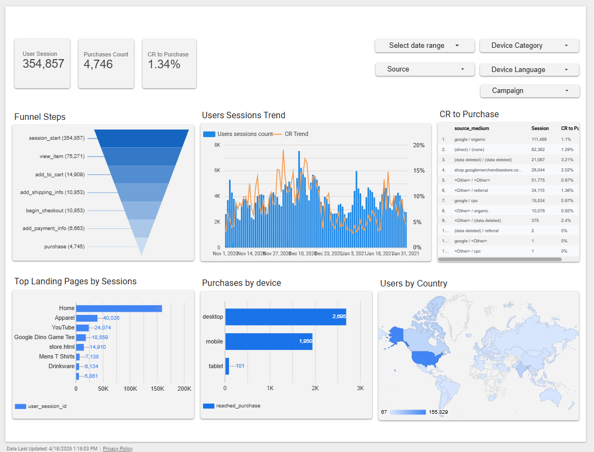

# E-commerce Funnel Analysis Dashboard

This project analyzes user behavior across the e-commerce funnel using GA4 event data.

## Project Goal
The goal of this project is to understand how users move from session start to purchase and identify drop-off points in the funnel.

## Tech Stack
- BigQuery
- SQL
- GA4 public dataset
- Looker Studio

## Funnel Steps
- session_start
- view_item
- add_to_cart
- begin_checkout
- add_shipping_info
- add_payment_info
- purchase

## Dashboard
Looker Studio dashboard link:  
https://datastudio.google.com/s/ozvmHsy3nHc

## Presantion
presantion link (Turkish):  
https://datastudio.google.com/s/ozvmHsy3nHc

## SQL
The SQL query used for this project is included in the `sql` folder.

## Files
- `sql/funnel_query.sql` → final SQL query
- `data_sample/sample_output.csv` → small sample output
- `dashboard/dashboard_screenshot.png` → dashboard screenshot

## Notes
GA4 raw event data was transformed into a session-based funnel dataset using SQL CTE logic.

## Author
Uğur Tekrin
